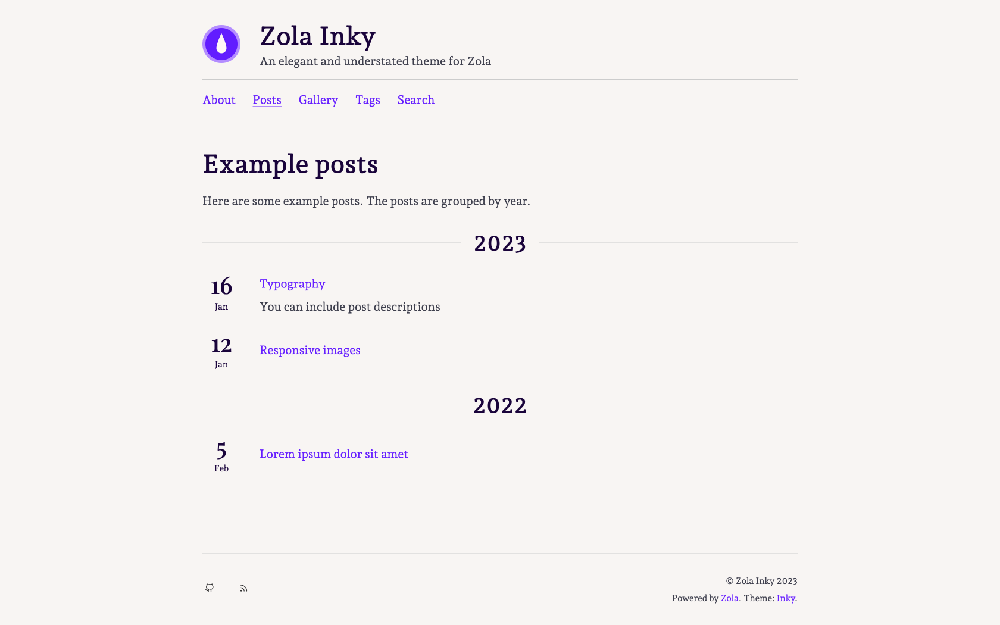

# My personal blog peterverheijen.nl

This is the public repository that contains my personal blog. The website is deployed with Netlify. The website is built with Zola-Inky, a Zola theme built on Rust.

## Zola-Inky

> An elegant and understated theme for Zola

Zola Inky ([view demo](https://jimmyff.github.io/zola-inky)) is a theme by [jimmyff](https://github.com/jimmyff) and [mr-karan](https://github.com/mr-karan) for the [Zola](https://www.getzola.org/) static site generator. This theme was originally based on the [hugo-ink](https://github.com/knadh/hugo-ink) theme, ported by mr-karan. It was then packaged and developed further by jimmyff. The theme is available on [Github](https://github.com/jimmyff/zola-inky) under the MIT license, for more information on how to use it please see the [readme](https://github.com/jimmyff/zola-inky/blob/main/README.md) and check the [changelog](https://github.com/jimmyff/zola-inky/blob/main/CHANGELOG.md) for a list of the latest changes.

